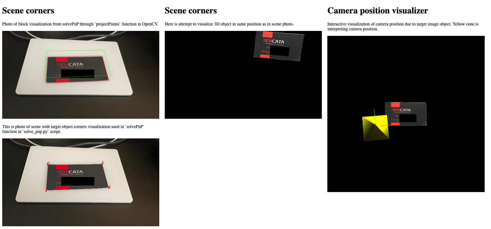

# Solve PnP OpenCV to WebGL (THREE.js) projection

This is debug environment for solving problem with calculation of PnP vectors in OpenCV
and project 3D model in browser.

## Where is the problem?

Problem is because OpenCV has different axis direction and maybe different order of dimensions
in points and matrices.

## Starting steps

__1. Run python script to get camera calibration matrix__

```shell script
python camera_calibration.py
```

__2. Solve PnP and get projection matrix__

```shell script
python solve_pnp.py
```

__3. Compile JS__

```shell script
npm run build
# or
npm run watch
``` 

__4. Start HTTP server__

```shell script
npm start
```

__5. Open debug visualizer in browser__

URL: http://127.0.0.1:8080


## Flow of this project

### 1. Camera calibration

In folder `calibration_images` is few screens from video with chessboard for camera calibration.

Script `camera_calibration.py` read this images and fill file `./temp/camera_calibration_data.json`
with data of camera calibration matrix and distortion coefficients.

### 2. Solve PnP

After that script `solve_pnp.py` take screen `./test_images/scene.png` and with list of target image
corners coordinates calculate rotation and translation vector.

In the same time create image `./test_images/solve_pnp_visualize.png` with box visualization on target image
to check, that calculation was right.

> There is the magic we need to solve. How to transform this vectors to be able use them in JavaScript
to visualize same target image in 3D on the same location as on scene image.
> Methods I already tried will be explained bellow.

Vectors and other calculations are saved to `./temp/pose_data.json` for using in Javascript.

### 3. Visualization in browser environment

In directory `./src` are Javascript files for visualization and debug data from OpenCV.

After starting node http server with command `npm start` and in same time webpack watcher `npm run watch`,
JS script is compiled and web environment is ready to show result on `http://127.0.0.1:8080`.

This web environment has 3 parts.

- Projection of box from python `solve_pnp.py` on scene image.
- 2D projection of used corners in scene image.
- 3D projection of scene. Our target is to have target image object in same position as on image scene photo.
- Interactive debug scene with projection of 3D projection camera as object to debug it's position
due to target image object.




## Captain diary

- [Here](https://stackoverflow.com/a/18643735/5799347) user ChronoTrigger explain how OpenCV and OpenGL has rotated axes,
but I wasn't able to make it work.
